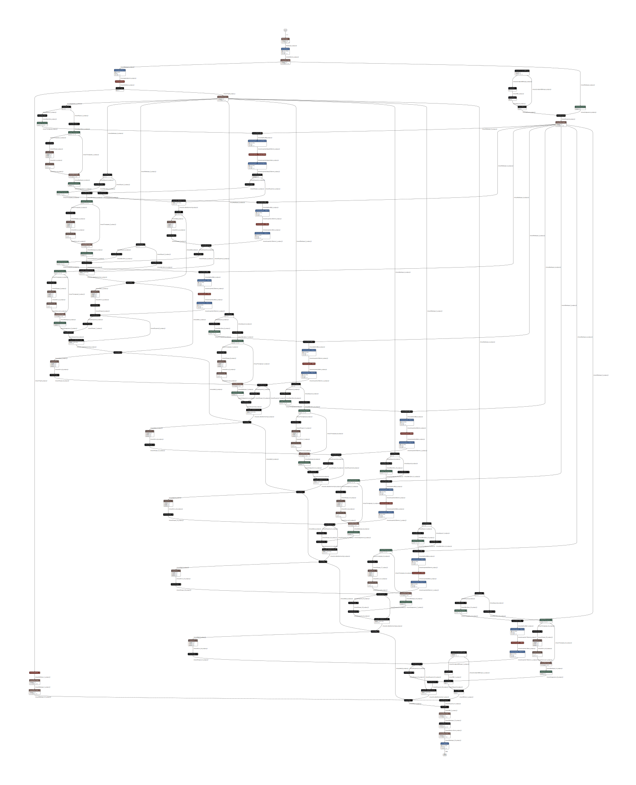

# mnist-onnx-runtime

基于MoE架构的MNIST分类模型

MoE model for MNIST

体验ONNX RUNTIME推理框架

Inference with ONNX Runtime with CPU/CUDA/TensorRT backend

## MoE模型原理


对于待计算的输入向量emb，

* 准备n个expert子网络
* 准备gateway linear层，输入emb可以输出n个概率值
* 选择n个概率中最高的top个位置，作为被选中的expert子网络
* emb分别被top个expert子网络运算，输出的emb分别与各自的概率值相乘，并pointwise相加，得到最终的输出向量emb

## 依赖

cuda11.8

```
https://developer.nvidia.com/cuda-11-8-0-download-archive
```

cuDNN 8.9
```
https://docs.nvidia.com/deeplearning/cudnn/archives/cudnn-860/install-guide/index.html
https://developer.nvidia.com/rdp/cudnn-archive
```

tensorrt8.6.0
```
wget 'https://developer.nvidia.com/downloads/compute/machine-learning/tensorrt/secure/8.6.1/tars/TensorRT-8.6.1.6.Linux.x86_64-gnu.cuda-11.8.tar.gz'
tar -xvf TensorRT-8.6.1.6.Linux.x86_64-gnu.cuda-11.8.tar.gz
export LD_LIBRARY_PATH=$LD_LIBRARY_PATH:`pwd`/TensorRT-8.6.1.6/lib
pip install TensorRT-8.6.1.6/python/tensorrt-8.6.1-cp310-none-linux_x86_64.whl
pip install TensorRT-8.6.1.6/graphsurgeon/graphsurgeon-0.4.6-py2.py3-none-any.whl 
pip install TensorRT-8.6.1.6/onnx_graphsurgeon/onnx_graphsurgeon-0.3.12-py2.py3-none-any.whl 
export LD_LIBRARY_PATH=$LD_LIBRARY_PATH:`pwd`/TensorRT-8.6.1.6/lib
```

pip dependencies
```
pip3 install torch torchvision torchaudio -i https://mirrors.aliyun.com/pypi/simple/  --index-url https://download.pytorch.org/whl/cu118
pip3 install matplotlib numpy netron tensorrt==8.6.1 onnx onnxruntime onnxruntime-gpu tensorrt -i https://mirrors.aliyun.com/pypi/simple/ 
```

## 配置

config.py控制模型结构：

```
INPUT_SIZE=28*28
EXPERTS=8
TOP=2
EMB_SIZE=16
```

* EXPERTS：专家网络总数量
* TOP：实际参与计算的网络数量

## 训练

```
python train.py
epoch:0 iter:0,loss:2.3661859035491943
epoch:1 iter:1000,loss:0.24321582913398743
epoch:2 iter:2000,loss:0.290910929441452
epoch:3 iter:3000,loss:0.12579798698425293
epoch:4 iter:4000,loss:0.07430635392665863
epoch:5 iter:5000,loss:0.10939159989356995
epoch:6 iter:6000,loss:0.05651797726750374
epoch:7 iter:7000,loss:0.22549636662006378
epoch:8 iter:8000,loss:0.05560129135847092
epoch:9 iter:9000,loss:0.25970810651779175
epoch:10 iter:10000,loss:0.016157114878296852
epoch:11 iter:11000,loss:0.11687115579843521
epoch:12 iter:12000,loss:0.13235501945018768
epoch:13 iter:13000,loss:0.03957831859588623
epoch:14 iter:14000,loss:0.04292204603552818
epoch:15 iter:15000,loss:0.07334394007921219
epoch:17 iter:16000,loss:0.08913449943065643
epoch:18 iter:17000,loss:0.03892162814736366
epoch:19 iter:18000,loss:0.0058897375129163265
epoch:20 iter:19000,loss:0.1377897411584854
epoch:21 iter:20000,loss:0.0813279002904892
epoch:22 iter:21000,loss:0.09385330975055695
epoch:23 iter:22000,loss:0.06127419322729111
epoch:24 iter:23000,loss:0.07625404745340347
epoch:25 iter:24000,loss:0.027989357709884644
epoch:26 iter:25000,loss:0.07605210691690445
epoch:27 iter:26000,loss:0.02338043600320816
epoch:28 iter:27000,loss:0.07522697001695633
epoch:29 iter:28000,loss:0.015342256054282188
epoch:30 iter:29000,loss:0.014924464747309685
epoch:31 iter:30000,loss:0.07528217136859894
epoch:33 iter:31000,loss:0.054232724010944366
epoch:34 iter:32000,loss:0.033958032727241516
epoch:35 iter:33000,loss:0.04543539509177208
epoch:36 iter:34000,loss:0.09922990947961807
epoch:37 iter:35000,loss:0.016302192583680153
epoch:38 iter:36000,loss:0.0324769951403141
epoch:39 iter:37000,loss:0.048769760876894
epoch:40 iter:38000,loss:0.16990777850151062
epoch:41 iter:39000,loss:0.037602465599775314
epoch:42 iter:40000,loss:0.004711015149950981
epoch:43 iter:41000,loss:0.056935325264930725
epoch:44 iter:42000,loss:0.008654932491481304
epoch:45 iter:43000,loss:0.10107047855854034
epoch:46 iter:44000,loss:0.004063411150127649
epoch:47 iter:45000,loss:0.02308676764369011
epoch:49 iter:46000,loss:0.025226552039384842
```

## torch原生推理

### 关于torch的trace和script模式

MoE模型由于存在gateway和expert动态控制流，因此导出ONNX计算图时需要采用torch的script模式，而非静态图trace模式。

关于torch模型的trace模式和script模式差异，见refs/torch-jit.jpg

### torch原生推理

```
python torch_infer.py
正确率:99.19 耗时: 17.579143285751343 s
```

## onnxruntime推理

### ONNX RUNTIME

微软开源的通用推理引擎，基于ONNX模型存储格式+RUNTIME框架，对深度学习框架和底层硬件之间实现了解耦和抽象

解决4个问题：

* Improve inference performance for a wide variety of ML models -- 通用的模型推理加速
* Run on different hardware and operating systems   -- 跨平台
* Train in Python but deploy into a C#/C++/Java app -- 提供SDK，实现跨语言推理
* Train and perform inference with models created in different frameworks   -- 跨深度学习框架

利用ONNX解决方案，可以对接主流深度学习框架训练的Model、自动选择并运行于多种硬件设备（CPU,GPU）、并能透明的基于tensorRT这样的英伟达加速技术进一步加速

ONNXRuntime的API非常简单，支持Python、C++、Java等主流语言，因此可以很方便利用JAVA/C++这样的语言实现自己的多线程推理服务，即具备生产级应用的开发能力

参考链接：

```
https://onnxruntime.ai/docs/get-started/with-python.html
```

###  onnxruntime cpu推理

```
python onnx_cpu_infer.py
正确率:99.17 耗时: 8.71111798286438 s
```

### onnxruntime cuda推理

```
python onnx_cuda_infer.py
正确率:99.17 耗时: 12.576208591461182 s
```

### onnxruntime quantize推理【性能退化】

```
python onnx_quantize_infer.py
正确率:99.14 耗时: 15.737791776657104 s
```

动态量化，比CUDA慢一点，应该是模型太简单体现不出来

### onnxruntime fp16推理【性能退化】

```
python onnx_fp16_infer.py 
正确率:99.17 耗时: 13.741032838821411 s
```

半精度，比CUDA慢，可能与我的2080ti显卡fp16特性有关，有条件的可以用高端卡跑跑看

### onnxruntime tensorrt推理

```
python onnx_trt_infer.py
正确率:99.17 耗时: 33.60489535331726 s
```

严重性能下降，看起来trt无法托管整个model，所以onnx把计算图的一部分给cuda引擎，一部分给了tensort引擎，中间的交换代价可能很高，没有深究

## 性能总结

我想onnxruntime cpu/cuda是不错的选择，开箱就有不错的效果，可以拿来给c++/java开发在线推理服务使用

## Netron可视化

ONNX官方推荐的模型查看工具，可以查看模型结构，以及查看模型参数

```
netron.start('model.onnx')
```



模型复杂了之后其实计算图是很难看懂的...

## 后续优化

根据B站友友提醒，需要考虑expert之间的均衡性，避免网络倾向于某几个expert。

参考论文：[OUTRAGEOUSLY LARGE NEURAL NETWORKS:
THE SPARSELY-GATED MIXTURE-OF-EXPERTS LAYER](https://arxiv.org/pdf/1701.06538)

增加2个特性：
- 训练阶段，gate的概率输出需要加上噪音，以便能有概率跳出expert倾向
- 训练阶段，需要补充1个额外的loss，目的是让各expert的总概率打分趋于一致，避免有expert倾向

这两个特性在推理阶段都会关闭。